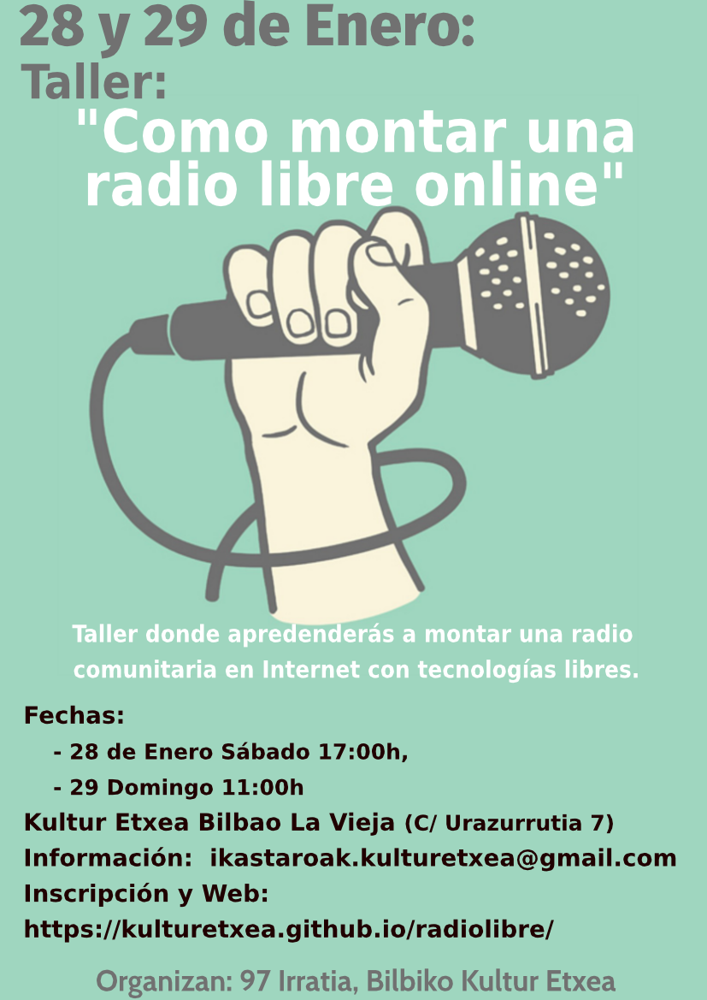

# Presentación 

Bienvenido a la **Web creada para el taller que vamos a impartir sobre como hacer una radio libre comunitaria en Internet usando tecnologías libres** como [Libretime](https://github.com/LibreTime). El taller abarcara durante dos días desde el montaje del sistema a la pogramación y difusión de contenidos. 
Nuestra intención es ir creando todo el material y manuales necesarios para cuando llegue el día del taller todos los recursos esten preparados y libremente disponibles para los asistentes o quien quiera.

# Información

* **Fechas**: El taller consta de dos sesiones. 
	* 27 de Enero Sábado a las 17:00 horas.
	* 28 de Enero Domingo a las 11:00 horas.
* **Lugar**: Kultur Etxea de Bilbao La Vieja (C/ Urazurrutia 7), Bilbao ([ver mapa](https://goo.gl/maps/tDxjRysVDn42)).
* **Organizadores**: Kultur Etxea, [97 Irratia](https://97irratia.info/es/).
* Correo electrónico de contacto: <ikastaroak.kulturetxea@gmail.com>.
* [Evento en Facebook](https://www.facebook.com/events/140717666728417/).
* Grupo de correo electrónico con invitación previa <gruporadiolibrekultur@googlegroups.com>.

# Inscripción al taller

Normalmente trabajamos con grupos pequeños de no más de 8 o 10 personas. Para que nadie que realmente quiera acudir al taller se quede sin plaza pedimos que os registreis en el formulario del enlace. Despues de inscribirte debe esperar a recibir la confirmación de plaza vía correo electrónico.

**[ENLACE A FORMULARIO DE INSCRIPCIÓN](https://goo.gl/forms/iNtwc8MNfF8mNawL2)**

Si por cualquier motivo a pesar de haberte inscrito ves que no puedes asistir por favor escribe un correo electrónico a <ikastaroak.kulturetxea@gmail.com>.

# Cartel

