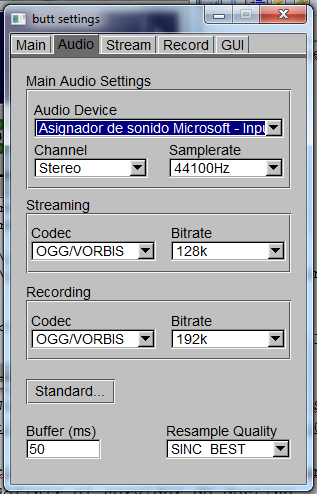

En este apartado vamos a mencionar las aplicaciones necesarias para la red de colaboradores de la comunidad que quieran publicar en el servidor.

# AUDACITY

# BUTT (broadcast using this tool)

Aplicación multiplataforma (Win,Mac,Linux) de streaming. Soporta servidores de streaming [Icecast](http://icecast.org/) y [SHOUTcast](https://www.shoutcast.com/). 

Butt se usa para transmitir audio en streaming desde la entrada de sonido del PC o un micro conectado a un servidor como LibreTime en este caso.

**Descarga** para MS Win de la Web oficial: [Windows Setup (.exe)](http://sourceforge.net/projects/butt/files/butt/butt-0.1.16/butt-0.1.16-setup.exe/download).

El proceso de instalación en Win es muy sencillo, cuando acaba ejecutamos la aplicación. En las opciones de configuración ('Settings') podemos definir el servidor de destino.

## Grabar una muestra de audio con Butt

Modificamos la configuración para que guarde la muestra de audio en formato [OGG](https://es.wikipedia.org/wiki/Ogg), en mi caso como estoy probando un micro externo también he tocado el primer desplegable, del resto de pestañas no he tocado nada más creo, cuando finalizemos la configuración es importante acordarse de salvar los cambios con el botón "Save". 

Volvemos a la pantalla principal y pulsamos el botón rojo de grabación, cuando paremos la grabación nos ofrece la opción de guardar el audio en un fichero con la fecha y hora (en mi caso 'rec_20180126-133101.ogg' de unos 30 segundos de 'ISEO & DODOSOUND - Roots in the Air'). 

Bueno ya que tenemos el fichero porque no lo subimos a LibreTime y lo programamos como un 'show'.

# ENLACES EXTERNOS

* [Setting up BUTT with Airtime – Sourcefabric Help Center](https://sourcefabricberlin.zendesk.com/hc/en-us/articles/212295803-Setting-up-BUTT-with-Airtime).
* [http://libretime.org/manual/icecast-handover/](http://libretime.org/manual/icecast-handover/).

