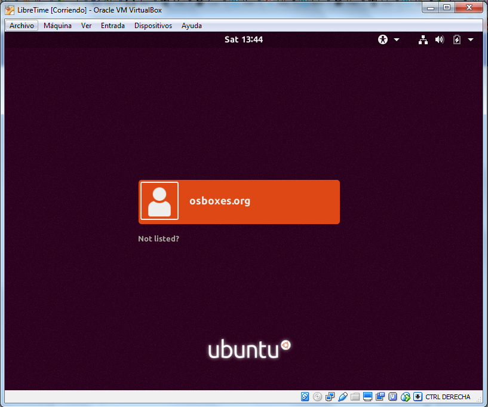
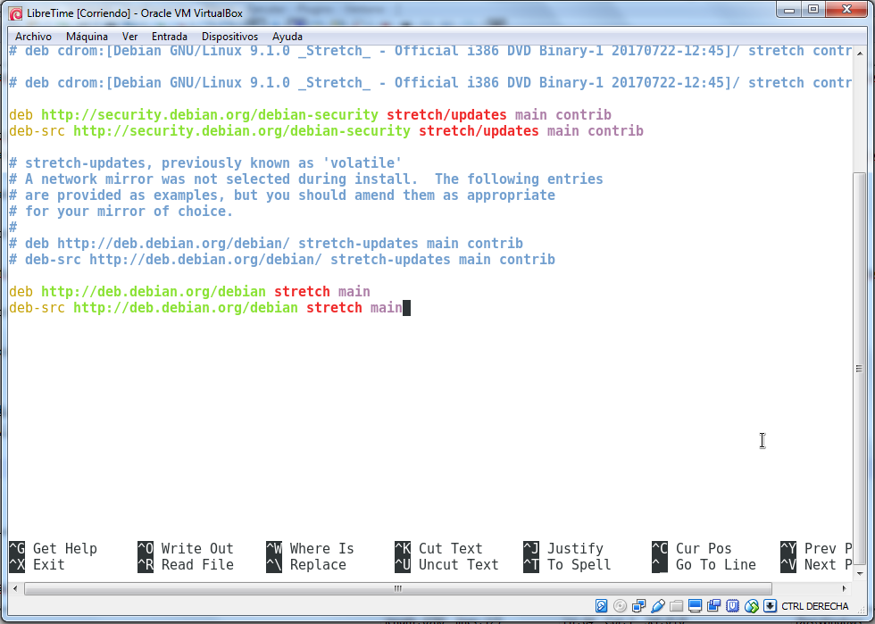
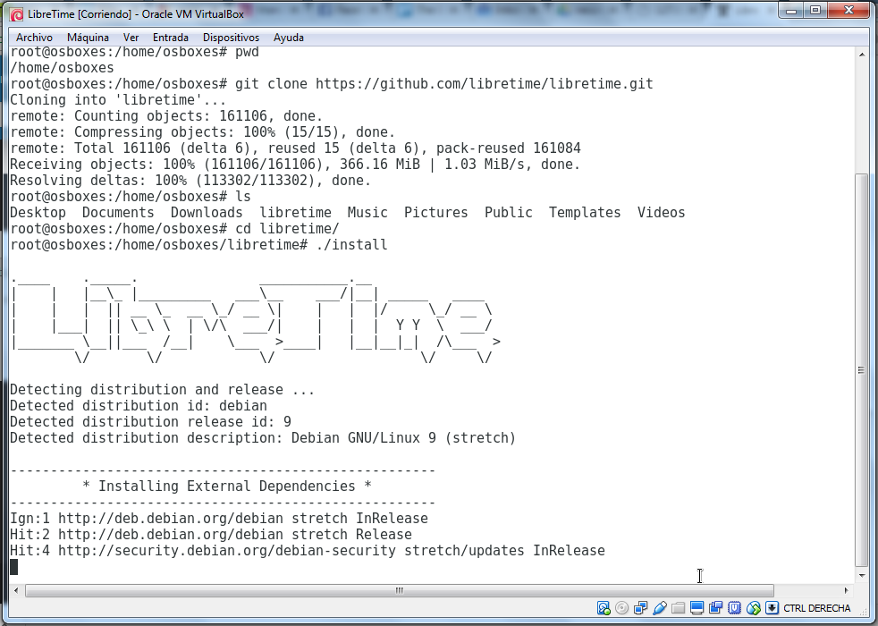
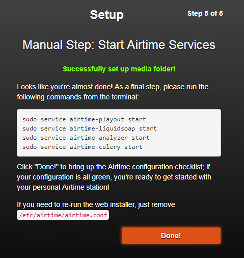

Este manual tiene como propósito dar algunas indicaciones generales para montar un entorno virtualizado en [Debian](https://www.debian.org/index.es.html) con una **instalación básica de Airtime para realizar pruebas**. La maquina usada como anfitrión es MS Windows 7 pero en teoría usando [VirtualBox](https://www.virtualbox.org/) se puede hacer sobre cualquier otro sistema operativo. 

Para poder seguir el manual se requiere algún nivel técnico ya que en muchos casos no entra al detalle de temas como Debian o Linux (o asistir al taller presencial). 

# CREANDO LA MÁQUINA VIRTUAL  

Virtualización técnica mediante la cual, utilizando un software determinado (QEMU, VirtualBox, Hyper-V, VMWare...), podemos crear un hardware "virtual", que a grandes rasgos funciona como un ordenador independiente, en el que instalar otro sistema operativo en él, por encima de nuestro sistema principal, y utilizarlo como si se tratase de un sistema operativo independiente y con la seguridad de que nada de lo que hagamos perjudicará al sistema real. 


Para crear la máquina virtual en un equipo con Windows 7 usaremos la aplicación [**VirtualBox**](https://www.virtualbox.org/), así que lo primero es bajar la aplicación e instalarla (yo tengo instalada la Versión 5.1.10 r112026 (Qt5.6.2)). Si usas un sistema operativo Linux,OS X o Windows no deberías tener problemas para instalar VirtualBox por primera vez, **VirtualBox** es multiplataforma y funciona muy bien, salvo los primeros pasos el resto será parecido en cualquier otro sistema operativo.

Descarga [VirtualBox-5.2.4-119785-Win.exe](http://bit.ly/2ljC3oI) para MS Windows (Google Drive).

Despues para ahorrar tiempo **bajaremos una imagen de Ubuntu o Debian reparada para VirtualBox**. En estos enlaces se pueden descargar diferentes versiones: [OSBoxes.org](http://www.osboxes.org/), [VirtualBoxes.org](https://virtualboxes.org/).

Esta distribución de Ubuntu por ejemplo es una de las que recomiendan en el propio manual de [LibreTime](http://libretime.org/manual/preparing-the-server/)
 [Ubuntu_16.04.3-VB-32bit.7z (1.0G)](https://drive.google.com/file/d/0B_HAFnYs6Ur-N0d2MGMxWGI5Uzg/view?usp=sharing) (Username: osboxes, password: osboxes.org).

Yo voy a probar con [**Debian 9.1 Stretch**](https://www.debian.org/News/2017/20170722) descargado de [OSBoxes.org](http://www.osboxes.org/debian/) como "Debian_9.1.0-VB-32bit.7z" comprimido con [7-Zip](http://www.7-zip.org/). Usuario: osboxes, clave: osboxes.org, Root Account Password: osboxes.org.

Los archivos con extensón VDI como "Debian 9.1.0 (32bit).vdi" o otros que queramos importar en Virtual Box es una imagen de un disco duro, por eso antes de empezar hay que crear una nueva maquina virtual. En el menú principal de Virtual Box seleccionamos Máquina > Nueva. 


En la siguiente pantalla asignamos la memoria RAM que se dedicará a la máquina virtual (mínimo 1GB recomendable). 

En el momento de seleccionar el disco duro debemos agregar uno existente (el archivo "Debian 9.1.0 (32bit).vdi" descargado y descomprimido previamente).  


Ya estamos preparados para arrancar nuestra máquina virtual con Debian.



# PASOS PREVIOS EN DEBIAN 

He abierto un terminal de comandos y me he logeado como administrador con `su` (solicita contraseña "osboxes.org")


Ahora instalo el cliente [Git](https://git-scm.com/) para clonar el repositorio [LibreTime](https://github.com/LibreTime/libretime) de GitHub:

```
# apt-get install git
```

Tengo un problema, el sistema me solicita que inserte el DVD de Debian para buscar los paquetes necesarios, cancelo la operación.

Edito el fichero que contiene los repositorios donde Debian busca para instalar las aplicaciones `# nano /etc/apt/sources.list`. La línea donde hace referencia al cdrom debemos comentarla escribiendo un '#' por delante (para familiarizarse con el editor de textos Nano dejo algunos enlaces en [Enlaces externos](libretime_y_virtualbox.md#enlaces-externos)).


Volvemos a tratar de instalar Git (`# apt-get install git`) pero en esta ocasión se produce un error de dependencias.


Voy a añadir dos nuevas líneas a `# nano /etc/apt/sources.list`:

```
deb  http://deb.debian.org/debian  stretch main
deb-src  http://deb.debian.org/debian  stretch main
```



Y después he ejecutado en la línea de comandos:
```
# apt update && apt upgrade
```

Para actualizar con la información de los nuevos repositorios y para actualizar las versiones de los paquetes que tenemos instalados en Debian.


Ahora ya puedo instalar Git:

```
# apt-get install git
```

# INSTALAR LIBRETIME 

Ahora voy a clonar el repositorio [LibreTime en GitHub](https://github.com/libretime/libretime.git).

```
# git clone https://github.com/libretime/libretime.git
```

Cuando se descargue LibreTime accedo a la carpeta y ejecuto el script `# ./install`. 



Durante la instalación configura:

* Apache
* IceCast
* PHP
* PostreSQL
* [RabbitMQ](https://www.rabbitmq.com/). 

y el resto de paquetes necesarios.

Por el momento una vez finalizada la instalación sólo puedo a [Icecast](http://icecast.org/) en [http://localhost:8000](http://localhost:8000) y a **página de instalación de LibreTime** en [http://localhost](http://localhost), he dejado todos los parámetros como estaban (con "airtime") y he seleccionado continuar.

**Paso 1 de 5**: Instalación de la base de datos. Username, clave y nombre 'airtime' y la máquina o host local 'localhost'. 


**Paso 2 de 5**: Configuración del broker de mensajería [RabbitMQ](https://www.rabbitmq.com/). Dejamos como está también como en el paso 1.


**Paso 3 de 5**: Configuración general.


**Paso 4 de 5**: Configuración de ruta alojamiento multimedia, dejamos como está (debería crear la ruta `/srv/airtime/stor/` automáticamente). 


**Paso 5 de 5**. Servicios (demonios en Linux). 




Para volver a iniciar el instalador Web sólo debemos borrar el fichero `/etc/airtime/airtime.conf`.


Cuando acaba la instalación muestra un resumen.


**Advertencia** errores:

* **Airtime Analyzer** no está arrancado como servicio, seguimos instrucciones ejecutando `service airtime_analyzer start` (luego comprobamos que está arrancado con `status`.
* **Pypo** (Airtime playout service): Reiniciamos demonio `service airtime-playout restart`.
* **Liquidsoap** (Airtime liquidsoap service): `service airtime-liquidsoap restart`.

Después de estos pequeños ajustes si refrescamos la página con el resumen de la instalación ya está todo correcto.

Ahora ya se puede acceder al interface de administración Web [http://localhost](http://localhost).


Ahora ya puedo acceder desde mi maquina anfitrión a LibreTime en [http://192.168.221.103/](http://192.168.221.103/) (usuario: admin, clave: admin).


# ADMINISTRACIÓN BÁSICA DE LAS APLICACIONES 

## Debian

Para averiguar los puertos que tenemos abiertos usamos el comando `ss`:

```
# ss -lntu
```

Servicios o demonios:


## Servidor Apache 

El fichero `/etc/apache2/sites-available/airtime.conf` contiene la configuración de la Web en PHP de Libretime.

Reiniciar el servicio Apache (o `start`|`stop`|`status`.. en vez de `reload`) :

```
# /etc/init.d/apache2 reload
```

Si se produce un error del comando `RewriteEngine` de Apache probablemente no este el módulo `rewrite` activado, usamos:

```
# a2enmod rewrite
``` 

Y volvemos a probar a arrancar el servicio de Apache. 

## Web en PHP

Los ficheros de la Web de administración de Airtime se encuentran normalmente en `/usr/share/airtime/php/`.


# ADMINISTRACIÓN REMOTA DEL SERVIDOR

## VNC

Para poder administrar remotamente el servidor Debian con LibreTime desde cualquier sitio y tener acceso completo a la máquina en modo gráfico lo mejor es instalar un servidor VNC

```
# apt install tightvncserver
```

Arrancamos la sesión en el servidor

```
# tightvncserver
```

Para conectarnos remotamente con un cliente VNC [TightVNC](http://www.tightvnc.com/download.php) o [UltraVNC](http://www.uvnc.com/) son buenas opciónes para MS Win.


Si queremos saber que IP tiene nuestra máquina virtual (especialmente si estamos en casa y nuestro router asigna IPs dinámicas usando DHCP) escribimos `# ip addr show`.

Otros comandos del servidor VNC:

service vncserver status

## SSH - Secure Shell

```
# apt-get install openssh-server
```

Ver más en [es/SSH - Debian Wiki](https://wiki.debian.org/es/SSH). Como cliente si usamos MS Win podemos usar [Putty](http://www.putty.org/) (usuario: osboxes, clave: osboxes.org). 


# RECURSOS Y AYUDA

El 	[repositorio GitHub de LibreTime](https://github.com/LibreTime/libretime) puede ser un sitio excelente para comenzar sobre todo si tenemos problemas con la instalación. Podemos crear un tema en la [pestaña "Issues"](https://github.com/LibreTime/libretime/issues).

También es recomendable siempre revisar la ]documentación oficial](http://libretime.org/). 


# Enlaces externos

* Web principal con documentación [http://libretime.org/](http://libretime.org/).
* Repositorio en [GitHub](https://github.com/LibreTime/libretime/).

**VNC Server**:

* [VNC server/client setup on Debian 9 Stretch Linux - LinuxConfig.org](	).

Editor **Nano**:

* [https://www.nanotutoriales.com/tutorial-del-editor-de-texto-nano](https://www.nanotutoriales.com/tutorial-del-editor-de-texto-nano).
* [https://www.atareao.es/software/programacion/nano-un-editor-de-texto-para-la-terminal/](https://www.atareao.es/software/programacion/nano-un-editor-de-texto-para-la-terminal/).